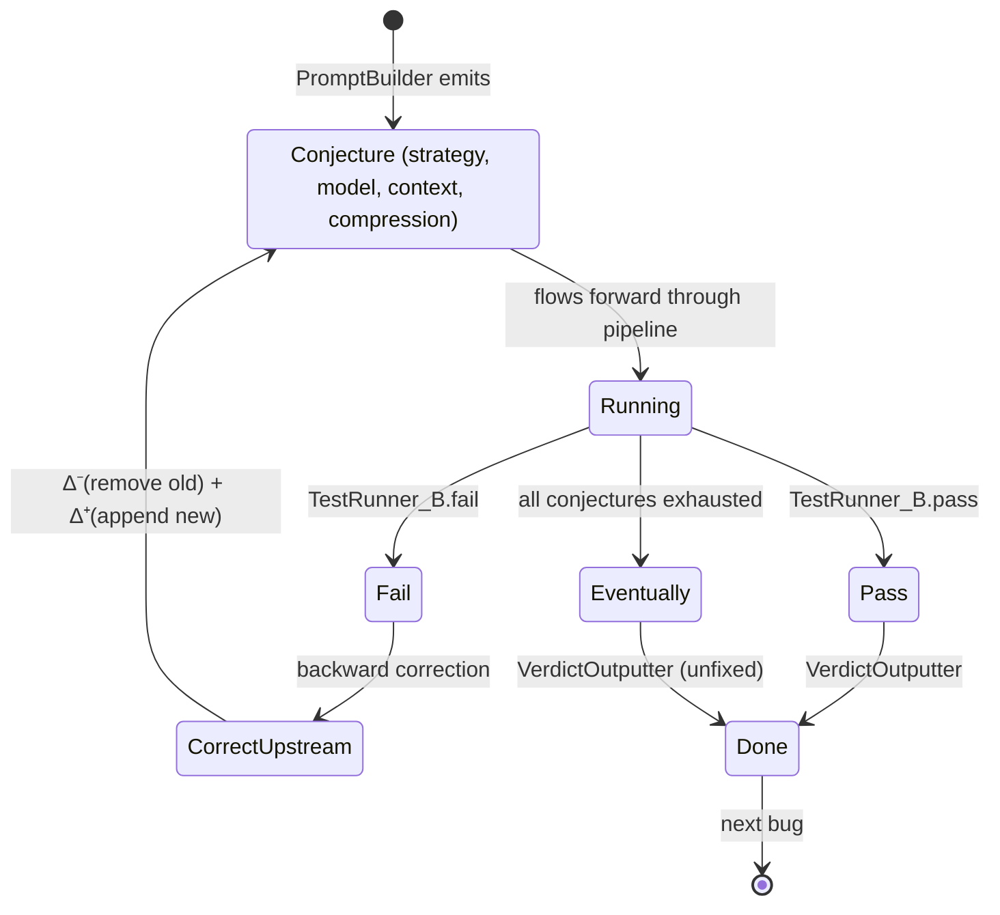

# APR Pipeline — Popper Reactive Dataflow (Final)

## Legend

| Symbol | Meaning |
|---|---|
| `→` solid | Forward data edge |
| `⇠` dashed red | Backward correction edge (Popper error handler) |
| `im+` | Incremental monotonic (appends only) |
| `im±` | Incremental non-monotonic (appends + deletes) |
| `i` | Non-incremental (recompute downstream) |
| `∆⁺` | Append stream |
| `∆⁻` | Delete stream |

---

## Full Dataflow

```mermaid
flowchart TB
    %% === STYLE DEFINITIONS ===
    classDef extractor fill:#1a73e8,color:#fff,stroke:#0d47a1
    classDef processor fill:#2e7d32,color:#fff,stroke:#1b5e20
    classDef errorHandler fill:#c62828,color:#fff,stroke:#b71c1c
    classDef outputter fill:#4a148c,color:#fff,stroke:#311b92
    classDef tokenOp fill:#e65100,color:#fff,stroke:#bf360c
    classDef llm fill:#00695c,color:#fff,stroke:#004d40
    classDef disk fill:#555,color:#fff,stroke:#333,stroke-dasharray: 5 5

    %% === EXTRACTOR ===
    Checkout[\"Defects4jCheckout<br/>extractor<br/><i>checkout + export tests</i>"/]:::extractor

    %% === STREAMS ===
    ProjRow[\"ProjectRow<br/>{project_dir, bug_id, triggering, relevant}"/]

    Checkout -->|"im+"| ProjRow

    %% === LOCALIZATION (no SourceRow — source lives on disk) ===
    TestRunner_A[TestRunner_A<br/>processor<br/><i>compile → run suite →<br/>parse stack → BugRow</i>]:::processor

    BugRow[\"BugRow<br/>{project_dir, file, line, method, test}"/]

    ProjRow -->|"im+"| TestRunner_A
    TestRunner_A -->|"im+"| BugRow

    %% === CONTEXT COLLECTOR (reads from disk on-demand) ===
    ContextCollect[ContextCollector<br/>processor<br/><i>D: method+test &vert; E: trace slice<br/>reads files from disk</i>]:::processor
    Disk1[(Disk<br/>project files)]:::disk

    CtxRow[\"ContextRow<br/>{level, method_src, test_src, trace}"/]

    BugRow -->|"im+"| ContextCollect
    Disk1 -.->|"read on-demand"| ContextCollect
    ContextCollect -->|"im+"| CtxRow

    %% === CONJECTURE GENERATION ===
    PromptBuilder[PromptBuilder<br/>processor<br/><i>context → LLM prompt</i>]:::processor
    TokenOptimizer[TokenOptimizer<br/>processor<br/><i>compress code context</i>]:::tokenOp
    LLMCaller[LLMCaller<br/>processor<br/><i>API call → patch</i>]:::llm
    PatchApplier[PatchApplier<br/>processor<br/><i>apply old→new string<br/>writes to disk</i>]:::processor
    TestRunner_B[TestRunner_B<br/>processor + errorHandler<br/><i>pass | fail | eventually</i>]:::errorHandler
    VerdictOut[\"VerdictOutputter<br/>outputter<br/><i>fixed / unfixed results</i>"/]:::outputter

    PromptRow[\"PromptRow<br/>{strategy, prompt_text}"/]
    OptimizedRow[\"OptPromptRow<br/>{compressed, tokens_saved}"/]
    PatchRow[\"PatchRow<br/>{file, old_str, new_str, model, reasoning}"/]
    AppliedRow[\"AppliedPatchRow<br/>{success, file, old_str, new_str}"/]
    PassRow[\"PassRow<br/>{bug_id, patch, tests_passed}"/]
    EventualRow[\"EventualRow<br/>{bug_id, unfixed, attempts}"/]

    CtxRow -->|"im+"| PromptBuilder
    PromptBuilder -->|"im+"| PromptRow
    PromptRow -->|"im+"| TokenOptimizer
    TokenOptimizer -->|"im+"| OptimizedRow
    OptimizedRow -->|"im+"| LLMCaller
    LLMCaller -->|"im+"| PatchRow
    PatchRow -->|"im+"| PatchApplier
    Disk1 -.->|"read file for backup"| PatchApplier
    PatchApplier -->|"im+"| AppliedRow
    AppliedRow -->|"im+"| TestRunner_B

    %% === TEST RUNNER B OUTPUT PORTS ===
    TestRunner_B -->|"pass"| PassRow
    TestRunner_B -->|"eventually()"| EventualRow
    PassRow -->|"im+"| VerdictOut
    EventualRow -->|"im+"| VerdictOut

    %% === BACKWARD CORRECTIONS (Popper style: edit upstream output) ===
    TestRunner_B -.->|"backward: ∆⁻(D-ctx) + ∆⁺(E-ctx)<br/>context escalation"| ContextCollect
    TestRunner_B -.->|"backward: ∆⁻(old prompt) + ∆⁺(new prompt)<br/>strategy change"| PromptBuilder
    TestRunner_B -.->|"backward: ∆⁻(light) + ∆⁺(heavy)<br/>model upgrade"| LLMCaller
    TestRunner_B -.->|"backward: ∆⁻(aggro) + ∆⁺(gentle)<br/>reduce compression"| TokenOptimizer
```

---

## Correction Lifecycle



---

## Conjecture Space — 32 Combinations

| Dimension | Values | Count |
|---|---|---|
| Context level | D, E | 2 |
| Model tier | light, heavy | 2 |
| Token compression | aggro, gentle | 2 |
| Prompt strategy | generic, CoT, minimal-change, TDD | 4 |

Total: 2 × 2 × 2 × 4 = **32**

### Escalation Order

Cheapest conjectures first, ordered by cost:

1. light + D + generic + aggro
2. light + D + CoT + aggro
3. light + D + minimal-change + aggro
4. light + D + TDD + aggro
5. light + D + generic + gentle
6. light + D + CoT + gentle
7. light + D + minimal-change + gentle
8. light + D + TDD + gentle
9. light + E + generic + aggro
10. light + E + CoT + aggro
11. light + E + minimal-change + aggro
12. light + E + TDD + aggro
13. light + E + generic + gentle
14. light + E + CoT + gentle
15. light + E + minimal-change + gentle
16. light + E + TDD + gentle
17. heavy + D + generic + aggro
18. heavy + D + CoT + aggro
19. heavy + D + minimal-change + aggro
20. heavy + D + TDD + aggro
21. heavy + D + generic + gentle
22. heavy + D + CoT + gentle
23. heavy + D + minimal-change + gentle
24. heavy + D + TDD + gentle
25. heavy + E + generic + aggro
26. heavy + E + CoT + aggro
27. heavy + E + minimal-change + aggro
28. heavy + E + TDD + aggro
29. heavy + E + generic + gentle
30. heavy + E + CoT + gentle
31. heavy + E + minimal-change + gentle
32. heavy + E + TDD + gentle

---

## Edge Label Summary

| Edge | Label | Why |
|---|---|---|
| `Checkout → ProjectRow` | `im+` | New bug = new project row |
| `ProjectRow → TestRunner_A` | `i` | Re-localization needs re-run |
| `TestRunner_A → BugRow` | `im+` | New failures → new bug rows |
| `BugRow → ContextCollector` | `im+` | New location → new context (disk) |
| `ContextCollector → PromptBuilder` | `im+` | New context → new prompt |
| `PromptBuilder → TokenOptimizer` | `im+` | New prompt → optimize |
| `TokenOptimizer → LLMCaller` | `im+` | Optimize → API call |
| `LLMCaller → PatchApplier` | `im+` | New patch → apply (to disk) |
| `PatchApplier → TestRunner_B` | `im+` | Applied → validate |
| `TestRunner_B.pass → VerdictOut` | `im+` | Passed → emit |
| `TestRunner_B.eventually → VerdictOut` | `im+` | Exhausted → emit (unfixed) |
| `← TestRunner_B → ContextCollector` | **backward** | `∆⁻`(D) + `∆⁺`(E) — escalate context |
| `← TestRunner_B → PromptBuilder` | **backward** | `∆⁻`(old) + `∆⁺`(new) — change strategy |
| `← TestRunner_B → LLMCaller` | **backward** | `∆⁻`(light) + `∆⁺`(heavy) — upgrade model |
| `← TestRunner_B → TokenOptimizer` | **backward** | `∆⁻`(aggro) + `∆⁺`(gentle) — reduce compression |
